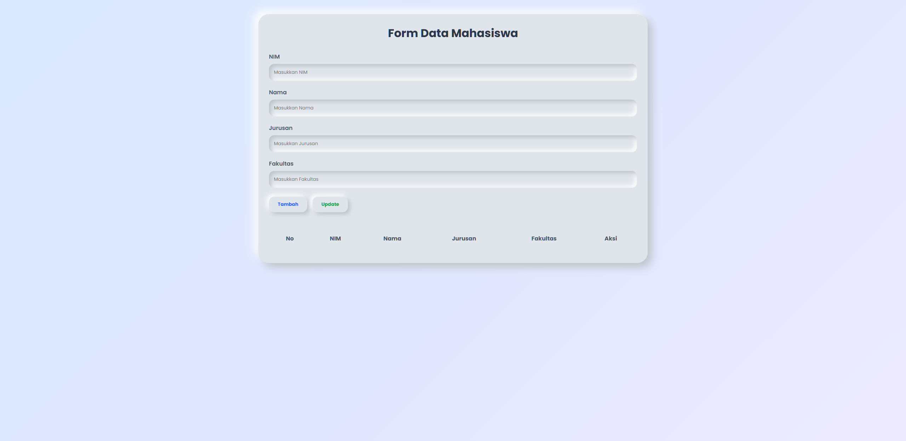
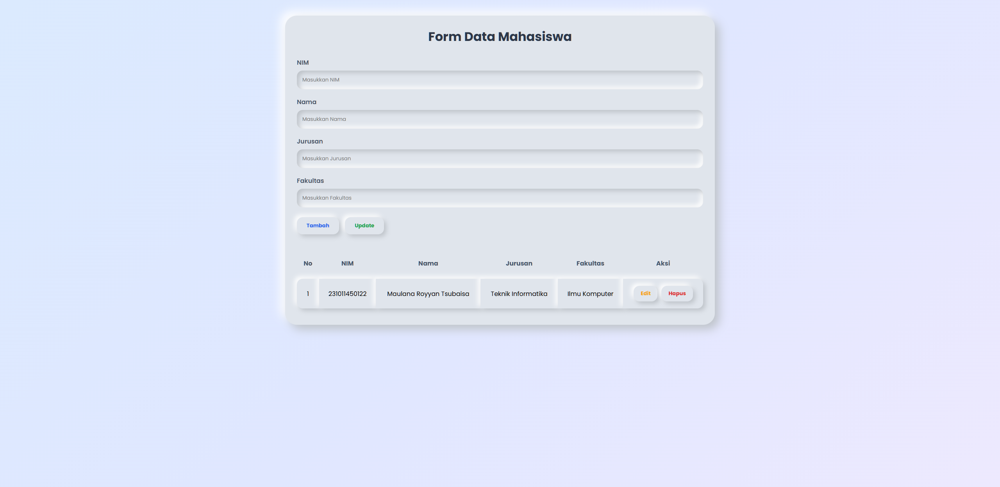
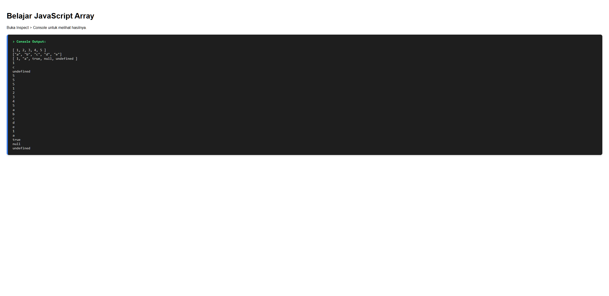
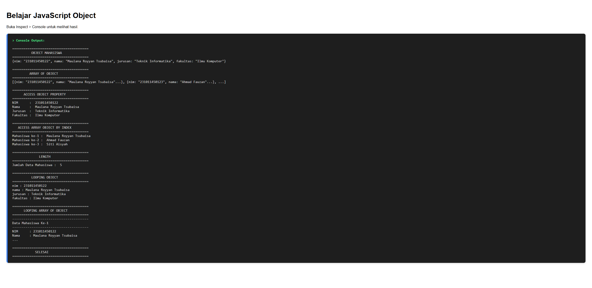

# Dokumentasi JavaScript Dasar (Pertemuan 14)
**Maulana Royyan Tsubaisa | Universitas Pamulang**

---

## 1. Pendahuluan
Dokumentasi ini berisi penjelasan dan hasil pengerjaan praktik JavaScript Dasar pada **Pertemuan 14**. Latihan ini mencakup pemahaman tentang:
- Manipulasi Array (`js_array.html`)
- Manipulasi Objek dan Array of Objects (`js_object.html`)
- Manipulasi DOM (Document Object Model) untuk membuat Form CRUD sederhana di sisi *client* tanpa terhubung ke database (`js.html`).

---

## 2. Struktur File
Terdapat tiga file HTML yang digunakan dalam latihan ini:
- `js.html`: Program interaktif CRUD Data Mahasiswa menggunakan JavaScript Form dan DOM.
- `js_array.html`: Program console log yang mensimulasikan penggunaan tipe data Array.
- `js_object.html`: Program console log yang mensimulasikan penggunaan tipe data Object dan struktur yang lebih kompleks.

---

## 3. Implementasi Kode dan Tampilan

### 3.1 Manipulasi DOM & Array (Form Data Mahasiswa - `js.html`)
File ini berisikan form input data mahasiswa sederhana (NIM, Nama, Jurusan, Fakultas) yang ditangani seluruhnya dengan JavaScript. 

- Form menggunakan style CSS berbasis Neumorphism.
- Seluruh state data mahasiswa disimpan pada sebuah variabel array global bernama `dataMahasiswa`.
- Terdapat fungsi `tambahData()`, `tampilkanData()`, `editData()`, `updateData()`, `hapusData()`, dan `kosongkanForm()` yang merender ulang DOM secara langsung menggunakan `.innerHTML`.

**Tampilan Awal (Form Kosong):**


**Tampilan Setelah Data Diinput:**


*Cara Kerja Singkat Kode JS:*
```javascript
let dataMahasiswa = []; // Inisialisasi array kosong

function tambahData() {
    // Ambil data dari elemen input berdasarkan ID
    let nim = document.getElementById("nim").value;
    let nama = document.getElementById("nama").value;
    // ... dst
    
    // Buat objek mahasiswa baru
    let mahasiswa = { nim: nim, nama: nama, jurusan: jurusan, fakultas: fakultas };
    
    // Masukkan ke array
    dataMahasiswa.push(mahasiswa);
    tampilkanData(); // Panggil fungsi re-render tabel
}
```

---

### 3.2 Tipe Data Array (`js_array.html`)
File ini difokuskan pada pembelajaran Array. Array adalah struktur data yang menyimpan satu atau lebih nilai ke dalam sebuah variabel tunggal.

*Penjelasan Kode:*
Program ini mendeklarasikan Array *number* `[1, 2, 3, 4, 5]`, Array *string* `["a", "b", "c", "d", "e"]`, dan Array *mix* (campuran tipe data). Kode juga menampilkan akses elemen array melalui *index* (dimulai dari `0`) dan perhitungan panjang elemen menggunakan `.length`, lalu menampilkannya menggunakan perulangan `for`.

**Output di Browser / Console:**


---

### 3.3 Tipe Data Object (`js_object.html`)
File ini difokuskan pada pembelajaran Object. Objek di JavaScript memungkinkan penyimpanan data dalam bentuk *Key-Value Pair* (pasangan kunci-nilai), sehingga datanya jauh lebih representatif dan mudah dipahami konteksnya dibandingkan menggunakan indeks numerik.

*Penjelasan Kode:*
Kode mensimulasikan satu entitas objek `mahasiswa` biasa, kemudian membuat struktur `dataMahasiswa` yang merupakan **Array of Object** (Array yang setiap elemennya berisi Objek). Program kemudian mendemonstrasikan perulangan menggunakan struktur `for...in` untuk mengambil nilai dari dalam *property* objek.

**Output di Browser / Console:**


---

## 4. Kesimpulan
Melalui latihan Pertemuan 14 ini, pemahaman terhadap konsep dasar tipe data majemuk di JavaScript (Array dan Object) berhasil diterapkan. Selain itu, cara mengakses elemen HTML (*DOM Manipulation*) secara dinamis terbukti mampu membangun fitur interaktif meskipun tidak ada *backend server* yang berjalan di belakang layar.
