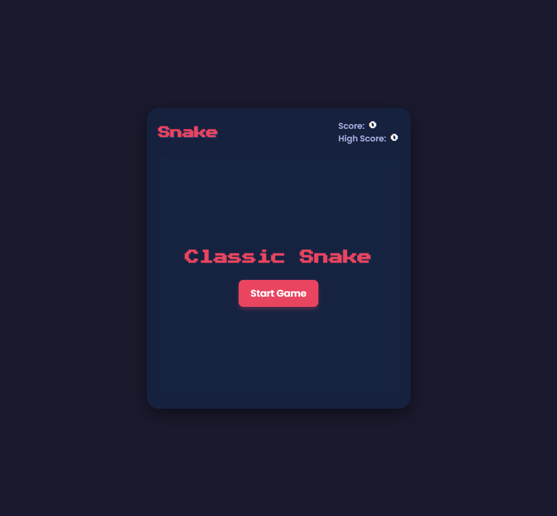
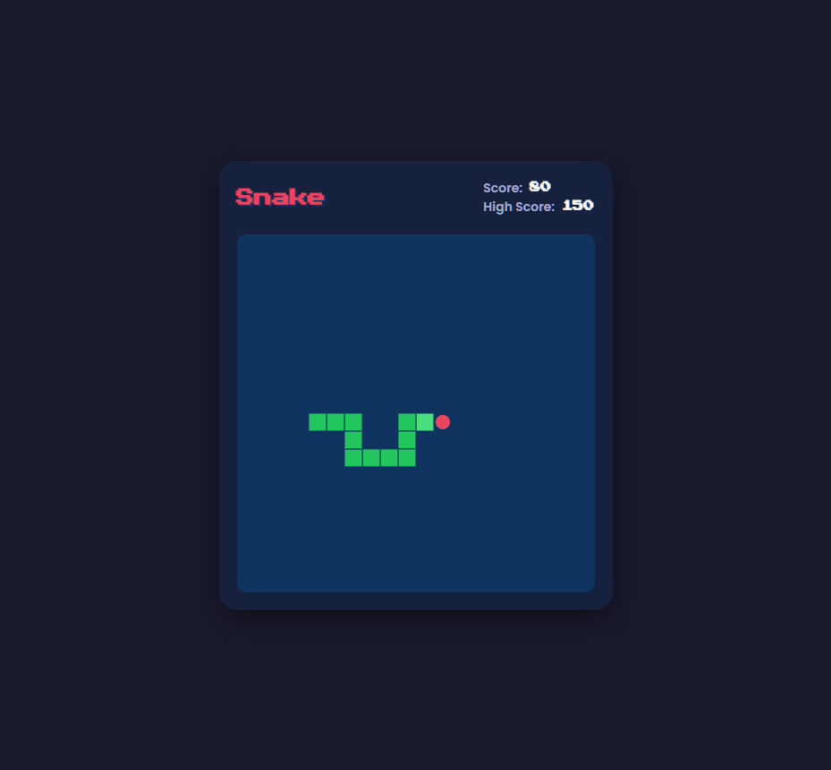
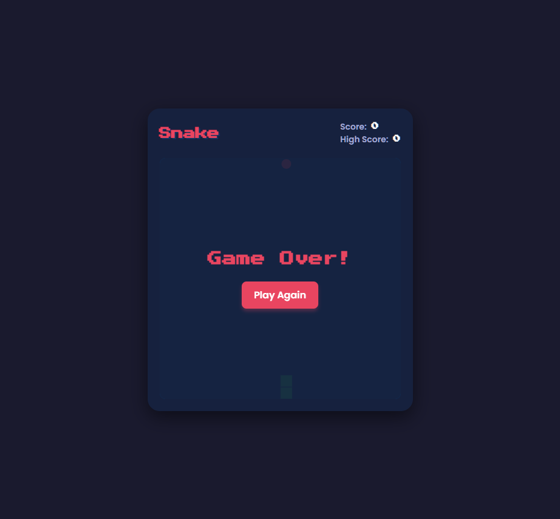

# Dokumentasi Mini Game JS: Classic Snake (Pertemuan 17)
**Maulana Royyan Tsubaisa | Universitas Pamulang**

---

## 1. Pendahuluan
Pada Pertemuan 17 ini, tugas difokuskan pada pembuatan game klasik interaktif menggunakan ekosistem web standar: **HTML, CSS, dan JavaScript**.
Game yang dipilih adalah **Classic Snake Game**. Game ini dipilih karena mendemonstrasikan secara kuat konsep-konsep kunci pemrograman web tingkat lanjut seperti manipulasi DOM secara Real-Time, rendering grafik ke dalam `<canvas>`, implementasi *Game Loop*, manajemen *State* yang persisten (High Score), serta responsivitas kontrol (*keyboard* dan *virtual D-pad*).

Aplikasi web ini dibangun dengan filosofi desain yang responsif (Mobile-Friendly) dan modern.

---

## 2. Fitur Utama Game
1. **HTML5 Canvas Rendering:** Grafis game dirender dengan performa tinggi menggunakan elemen `<canvas>`.
2. **Game Loop:** Menggunakan `setInterval` untuk menjaga *framerate* yang konsisten.
3. **Responsive & Mobile Friendly:** Ukuran kanvas menyesuaikan layar, dan dilengkapi dengan *Virtual D-Pad* (kontrol sentuh) yang akan muncul secara dinamis di perangkat *mobile* dan disembunyikan di perangkat *desktop*.
4. **Persistent High Score:** Menggunakan `localStorage` bawaan browser untuk menyimpan skor tertinggi pemain meskipun *browser* telah ditutup.
5. **Progressive Difficulty:** Kecepatan (*speed*) game akan bertambah seiring bertambahnya skor pemain.

---

## 3. Tampilan Antarmuka Game

### 3.1 Layar Utama (Start Screen)
Ketika game dimuat pertama kali, pemain disambut dengan layar menu dengan tombol "Start Game".


### 3.2 Gameplay Berlangsung
Di dalam permainan, pemain mengontrol ular hijau (dengan kepada berwarna hijau terang) untuk memakan buah apel berwarna merah (`#e94560`). Skor diperbarui secara instan di papan skor atas.


### 3.3 Game Over Screen
Bila ular menabrak tembok pinggir atau menabrak tubuhnya sendiri, *Game Loop* dihentikan dan layar Game Over akan muncul yang menyediakan opsi untuk "Play Again".


---

## 4. Penjelasan Implementasi Kode

### 4.1. Struktur Layout (HTML)
File `index.html` membungkus `<canvas>` bersama elemen menu di dalam struktur `.game-container`. Disediakan juga panel `div.controls` untuk tombol D-Pad yang hanya aktif di tampilan mobile (lebar layar kecil).

### 4.2. Styling Responsif Modern (CSS)
Di `style.css`, game dirancang menggunakan *CSS Flexbox* agar tampil sempurna di tengah layar.
Desain mengadopsi palet warna '*Dark Mode*' yang tidak menyilaukan mata, font '*Press Start 2P*' bergaya pixel-art retro, dan memastikan ukurannya tidak tumpah ke luar layar (Mobile-first). Kontrol virtual otomatis disembunyikan jika ukuran layar lebih dari `768px`.

### 4.3. Logika Inti Permainan (JavaScript)

#### A. Rendering & Variabel State
Ular (`snake`) direpresentasikan sebagai sebuah tipe data **Array of Object**, di mana tiap objek menampung posisi kordinat `x` dan `y`.
```javascript
// Awal permainan, tubuh ular berisi 3 kotak segmen
let snake = [];
for (let i = 0; i < 3; i++) {
    snake.push({ x: 10 - i, y: 10 });
}
```

#### B. Algoritma Pergerakan Ular (`moveSnake()`)
Setiap kali *game loop* berjalan, program menggeser posisi "kepala" (`head`) ular ke arah *X* atau *Y* tujuan. Nilai arah (`dx` dan `dy`) ditentukan dari tombol apa yang ditekan pemain.
Jika apel dimakan, koordinat tubuh tidak dipotong (`pop()`). Jika tidak memakan apel, segmen tubuh paling belakang (ekor) dihapus dengan perintah `snake.pop()` agar ukuran ular tetap.
```javascript
const head = { x: snake[0].x + dx, y: snake[0].y + dy };
snake.unshift(head); // Tambahkan kepala baru ke depan

if (head.x === appleX && head.y === appleY) {
    score += 10;
    spawnApple(); // Jangan pop() tubuh jika makan, ular jadi lebih panjang
} else {
    snake.pop(); // Hapus ekor karena bergeser maju
}
```

#### C. LocalStorage untuk Menyimpan High Score
Ketika apel dimakan dan `score` melampaui `highScore`, sistem merekam skor tersebut ke dalam memori browser.
```javascript
if (score > highScore) {
    highScore = score;
    localStorage.setItem('snakeHighScore', highScore);
}
```

#### D. Kontrol (Desktop & Mobile)
Skrip menambahkan `EventListener` terhadap tombol panah maupun W/A/S/D di *keyboard* perangkat Desktop, juga menangani sentuhan pada Virtual D-Pad (tombol panah di bawah layar) untuk Mobile. Di dalam kedua fungsi ini, program memvalidasi agar ular tidak berbalik arah 180 derajat ke dalam tubuhnya sendiri.

---

## 5. Kesimpulan
Pembuatan *Snake Game* menggunakan Canvas memberikan pengalaman belajar yang sangat padat mengenai bagaimana JavaScript mengontrol siklus kejadian (*Event Loop*) dan merepresentasi perubahan data (Array) langsung menjadi visual secara terus-menerus (60 frame/detik).
Game ini ringan, dapat dimainkan di *Handphone* maupun Laptop, dan telah menyertakan fungsi persistensi data *localStorage*.
